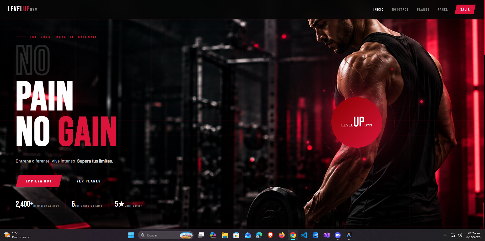
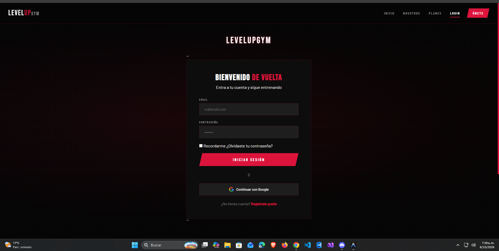
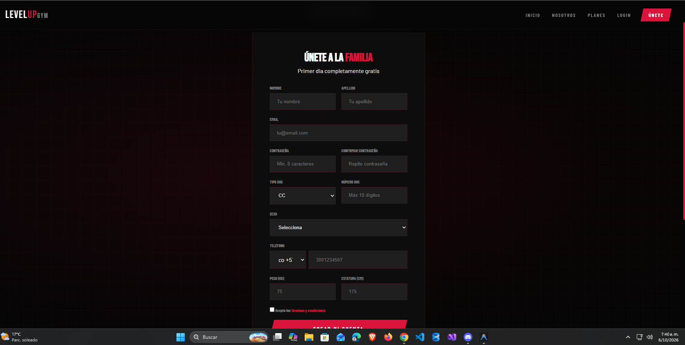
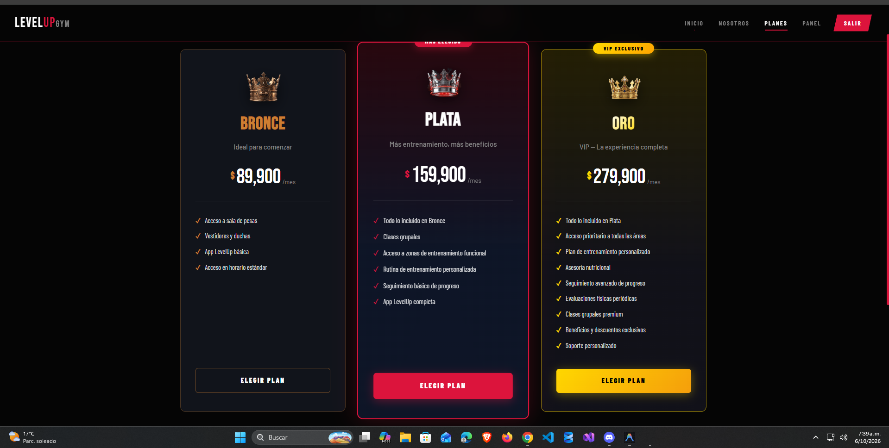
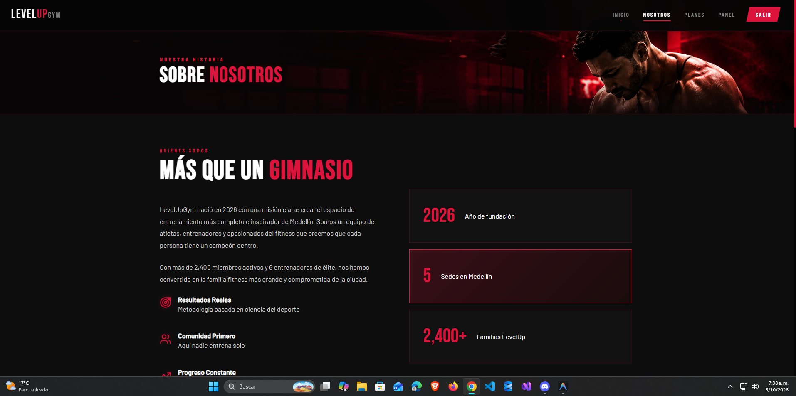

sional.md
100%
<!--
  PLANTILLA DE REFERENCIA
  Este es un ejemplo de README profesional. Puedes usarlo como base o seguir otro formato.
  Cómo usarlo: copia este archivo en la raíz de tu repo con el nombre README.md
  y reemplaza todo lo que está entre [corchetes] con la información de tu proyecto.
  Borra las secciones que no apliquen. (Este comentario no se ve en GitHub.)
-->

# [LevelUpGym]

> ["Sistema web integral para la gestión de gimnasios, diseñado para administrar clientes, membresías, progreso físico, objetivos, clases grupales y procesos administrativos desde una plataforma centralizada."]



## 📌 El problema
[Los gimnasios necesitan administrar diferentes procesos relacionados con sus clientes, membresías, progreso físico, objetivos, clases y personal. Cuando esta información se gestiona de manera manual o mediante diferentes herramientas, puede ser difícil mantener un control organizado y actualizado.]

## ✅ La solución
[LevelUpGym es una plataforma web que centraliza la gestión de los principales procesos de un gimnasio, proporcionando herramientas específicas tanto para los administradores como para los clientes.

El sistema permite administrar la información de los usuarios, controlar membresías, realizar seguimiento del progreso físico, establecer objetivos, gestionar clases grupales y facilitar la interacción del cliente con los servicios del gimnasio.]

**Funcionalidades principales:**
- [Registro y gestión de clientes.]

- [Autenticación y control de acceso mediante roles.]
- [Gestión de planes de membresía.]
- [Procesamiento y registro de pagos.]
- [Creación y seguimiento de objetivos personales.]
- [Seguimiento del progreso corporal.]
- [Gestión de clases grupales y reservas.]
- [Gestión de entrenadores y roles del gimnasio.]
- [Programación de sesiones.]
- [Panel administrativo.]
- [Panel personalizado para clientes.]
- [Interfaz web responsive y moderna.]

## 🛠️ Tecnologías
| Capa | Tecnología |
|---|---|
| Frontend | [Angular] |
| Backend | [C# / ASP.NET Core .NET 10] |
| Base de datos | [SQL Server] |
| Otras | [Git, GitHub, JWT, Entity Framework Core] |

## 🏗️ Arquitectura
[Usuario -> Frontend Angular HTTP/APi -> Backend C# ASP.NET Core .NET 10 JWT -> Entity Framework Core -> SQL Server]

## 🚀 Cómo ejecutarlo
**Requisitos:** [Antes de ejecutar el proyecto, asegúrate de tener instaladas las siguientes herramientas:

Node.js — versión 20 o superior
Angular CLI
.NET 10 SDK
SQL Server
Git
Visual Studio 2022 o Visual Studio Code — recomendado]


Configurar la base de datos

Crear una base de datos en SQL Server y configurar la cadena de conexión del proyecto backend.

En appsettings.json o appsettings.Development.json, configurar:

{
  "ConnectionStrings": {
    "DefaultConnection": "Server=DAGADEV;Database=levelupgym_db;Integrated Security=True;TrustServerCertificate=True;MultipleActiveResultSets=False"
  }
}
```bash
# 1. Clonar el repositorio
git clone https://github.com/brayan25499/levelupgym-/tree/dev
cd [repo]

# 2. [Instalar dependencias / importar la base de datos]
[cd backend
cd LevelUpGym
dotnet restore
dotnet ef database update
dotnet run]

[cd Frontend
cd LevelUpGym
npm install
npm start]


# 3. [Ejecutar]
```
[cd backend
cd LevelUpGym
dotnet run]

[cd Frontend
cd LevelUpGym
npm start]


**Demo:** [[Enlace al proyecto desplegado o al video funcionando](https://www.youtube.com/watch?v=eUAHRtpDb7c)]

## 📸 Capturas
| Pantalla | Descripción |
|---|---|
|  | [Donde el usuario ingresa] |
|  | [Donde el usuario se registra] |
|  | [Donde el usuario ve los planes] |
|  | [Quienes somos nosotros] |

## 👥 Equipo
| Nombre | Rol | GitHub |
|---|---|---|
| [David Gonzalez] | [Backend, base de datos, frontend] | [@bigbangblood] |
| [Brayan Valencia] | [Frontend] | [@brayan25499] |
| [Hillary Zabatt Cordoba] | [Frontend] | [@hilly00] |

## 📄 Contexto
Proyecto formativo del programa **Análisis y Desarrollo de Software (ADSO)** · SENA · [Centro de tecnologia Mobiliario] · [2026].

---

### Lo que mira un líder técnico o un jurado en los primeros 2 minutos
1. ¿Entiendo **qué hace** el proyecto en la primera línea?
2. ¿Hay **capturas o un video** que lo muestren funcionando?
3. ¿Puedo **ejecutarlo** siguiendo las instrucciones, sin preguntarle a nadie?
4. ¿Se ve **ordenado**: carpetas claras, sin archivos basura, commits con buenos mensajes?
5. ¿Sé **quién hizo qué**?